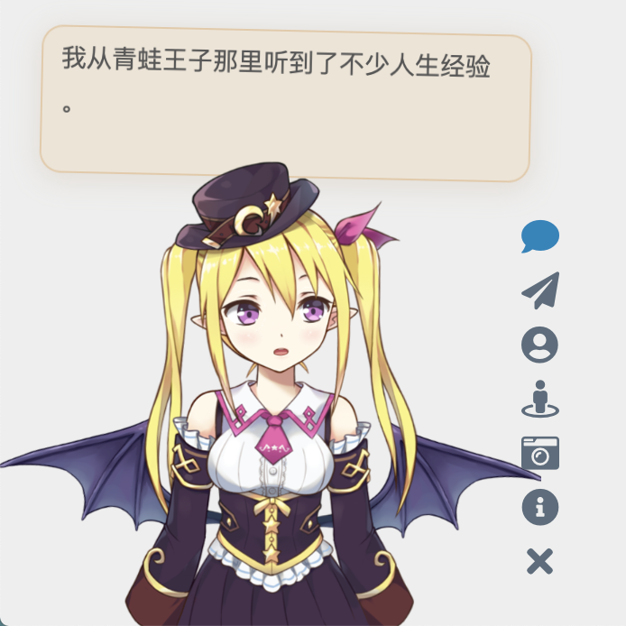

# Live2D Widget (繁體中文)


[English](README.en.md)

## 特性

在網頁中加入 Live2D 看板娘。相容於 PJAX，支援無刷新載入。

Credit to [@stevenjoezhang](https://github.com/stevenjoezhang) for the original repository



（註：以上人物模型僅供展示之用，本倉庫不包含任何模型。）

你也可以查看範例網頁： (简体中文)

- 在 [米米的部落格](https://zhangshuqiao.org) 的左下角可查看效果
- [demo/demo.html](https://live2d-widget.pages.dev/demo/demo)，展現基礎功能
- [demo/login.html](https://live2d-widget.pages.dev/demo/login)，仿 NPM 的登陸介面

## 使用

如果你是小白，或只需要最基礎的功能，那麼只用將這一行程式碼加入 html 頁面的 `head` 或 `body` 中，即可載入看板娘：
```xml
<script src="https://fastly.jsdelivr.net/npm/live2d-widgets@0/autoload.js"></script>
```
新增程式碼的位置取決於你的網站的建構方式。例如，如果你使用的是 [Hexo](https://hexo.io)，那麼需要在主題的模版檔案中加入以上程式碼。對於用各種模版引擎產生的頁面，修改方法類似。
如果網站啟用了 PJAX，由於看板娘不必每頁刷新，需要注意將該腳本放到 PJAX 刷新區域之外。

**但是！我們強烈建議自己進行配置，讓看板娘更適合你的網站！**
如果你有興趣自己折騰的話，請看下面的詳細說明。

## 配置

你可以對照 `dist/autoload.js` 的源碼查看可選的設定項目。 `autoload.js` 會自動載入三個檔案：`waifu.css`，`live2d.min.js` 和 `waifu-tips.js`。 `waifu-tips.js` 會建立 `initWidget` 函數，這就是載入看板娘的主函數。 `initWidget` 函數接收一個 Object 類型的參數，作為看板娘的配置。以下是配置選項：

| 選項 | 類型 | 預設值 | 說明 |
| - | - | - | - |
| `waifuPath` | `string` | `https://fastly.jsdelivr.net/npm/live2d-widgets@0/waifu-tips.json` | 看板娘資源路徑，可自行修改 |
| `apiPath` | `string` | `https://live2d.fghrsh.net/api/` | API 路徑，可選參數 |
| `cdnPath` | `string` | `https://fastly.jsdelivr.net/gh/fghrsh/live2d_api/` | CDN 路徑，選用參數 |
| `tools` | `string[]` | 見 `autoload.js` | 載入的小工具按鈕，可選參數 |

其中，`apiPath` 和 `cdnPath` 兩個參數設定其中一項即可。 `apiPath` 是後端API 的URL，可以自行搭建，並增加模型（需要修改的內容比較多，此處不再贅述），可以參考[live2d_api](https://github.com/fghrsh/live2d_api) 。而 `cdnPath` 則是透過 jsDelivr 這樣的 CDN 服務載入資源，更加穩定。

## 自訂

如果以上「配置」部分提供的選項還不足以滿足你的需求，那麼你可以自己進行修改。本倉庫的目錄結構如下：

- `src/` 目錄下包含了各個元件的程式碼，例如按鈕和對話框等；
- `build/` 目錄下包含了 TypeScript 建置後的檔案；
- `dist/` 目錄下包含了進一步打包後網頁直接可用的文件，其中：
 - `autoload.js` 是用於自動載入其它資源，例如樣式表等；
 - `waifu-tips.js` 是由 `build/waifu-tips.js` 自動打包產生的，不建議直接修改；
 - `waifu-tips.json` 中定義了觸發條件（`selector`，CSS 選擇器）和觸發時顯示的文字（`text`）；
 - `waifu.css` 是看板娘的樣式表。

`waifu-tips.json` 中預設的CSS 選擇器規則是對Hexo 的[NexT 主題](http://github.com/next-theme/hexo-theme-next) 有效的，為了適用於你自己的網頁，可能需要自行修改，或增加新內容。

> [!WARNING]
> `waifu-tips.json` 中的內容可能不適合所有年齡段，或不宜在工作期間訪問。在使用時，請自行確保它們是合適的。

要在本機部署本專案的開發測試環境，你需要安裝 Node.js 和 npm，然後執行以下命令：

```bash
git clone https://github.com/Yuzuk1Shimotsuki/live2d-widget-tc.git
npm install
npm run build
```

如果有任何疑問，歡迎提 Issue。如果有任何修改建議，歡迎提 Pull Request。

## 部署

在本地完成了修改後，你可以將修改後的項目部署在伺服器上，或者透過 CDN 加載，以便在網頁中使用。

### 使用 CDN

要自訂相關內容，可以把這個倉庫 Fork 一份，然後把修改過的內容通過 git push 到你的倉庫中。這時，使用方法對應地變為
```xml
<script src="https://fastly.jsdelivr.net/gh/username/live2d-widget-tc@latest/autoload.js"></script>
```
將此處的 `username` 替換為你的 GitHub 使用者名稱。為了使 CDN 的內容正常刷新，需要建立新的 git tag 並推送至 GitHub 倉庫中，否則此處的 `@latest` 仍然指向更新前的檔案。此外 CDN 本身存在緩存，因此改動可能需要一定的時間生效。相關文件：
- [Git Basics - Tagging](https://git-scm.com/book/en/v2/Git-Basics-Tagging)
- [Managing releases in a repository](https://docs.github.com/en/repositories/releasing-projects-on-github/managing-releases-in-a-repository)

### Self-host

你也可以直接把這些檔案放到伺服器上，而不是透過 CDN 載入。

- 如果你能夠透過 `ssh` 連接你的主機，請把 Fork 並修改過的程式碼倉庫複製到伺服器上。
- 如果你的主機無法用 `ssh` 連線（例如一般的虛擬主機），請在本機修改好程式碼後，透過 `ftp` 等方式將檔案上傳到主機的網站的目錄下。
- 如果你是透過 Hexo 等工具部署的靜態博客，請把本專案的程式碼放在博客原始檔目錄下（例如 `source` 目錄）。重新部署部落格時，相關文件就會自動上傳到對應的路徑下。為了避免這些檔案被 Hexo 外掛程式錯誤地修改，可能需要設定 `skip_render`。

這樣，整個計畫就可以透過你的網域存取了。不妨試試能否正常地透過瀏覽器開啟 `autoload.js` 和 `live2d.min.js` 等文件，並確認這些文件的內容是完整且正確的。
一切正常的話，接下來修改 `autoload.js` 中的常數 `live2d_path` 為 `live2d-widget` 這一目錄的 URL 即可。比如說，如果你能夠通過
```
https://example.com/path/to/live2d-widget-tc/live2d.min.js
```
造訪到 `live2d.min.js`，那麼就把 `live2d_path` 的值修改為
```
https://example.com/path/to/live2d-widget-tc/
```
路徑末端的 `/` 一定要加上。
完成後，在你要加入看板娘的介面加入
```xml
<script src="https://example.com/path/to/live2d-widget-tc/autoload.js"></script>
```
就可以加載了。

## 鳴謝

<a href="https://www.browserstack.com/">
  <picture>
    <source media="(prefers-color-scheme: dark)" height="80" srcset="https://d98b8t1nnulk5.cloudfront.net/production/images/layout/logo-header.png?1469004780">
    <source media="(prefers-color-scheme: light)" height="80" srcset="https://live.browserstack.com/images/opensource/browserstack-logo.svg">
    
  </picture>
</a>

> 授權瀏覽器Stack 用戶端來執行我們的程式碼。
> 感謝 [BrowserStack](https://www.browserstack.com/) 提供讓我們可以在真實瀏覽器中進行測試的基礎設施！

<a href="https://www.jsdelivr.com">
  <picture>
    <source media="(prefers-color-scheme: dark)" height="80" srcset="https://raw.githubusercontent.com/jsdelivr/jsdelivr-media/master/white/svg/jsdelivr-logo-horizontal.svg">
    <source media="(prefers-color-scheme: light)" height="80" srcset="https://raw.githubusercontent.com/jsdelivr/jsdelivr-media/master/default/svg/jsdelivr-logo-horizontal.svg">
    
  </picture>
</a>

> 感謝 jsDelivr 提供公共 CDN 服務。

程式碼來自這篇文章魔改而來：
https://www.fghrsh.net/post/123.html

感謝 [一言](https://hitokoto.cn) 提供的語句介面。

點擊看板娘的紙飛機按鈕時，會出現一個彩蛋，這來自於[WebsiteAsteroids](http://www.websiteasteroids.com)。

## 更多

更多內容可以參考：
https://nocilol.me/archives/lab/add-dynamic-poster-girl-with-live2d-to-your-blog-02
https://github.com/xiazeyu/live2d-widget.js
https://github.com/summerscar/live2dDemo

關於後端 API 模型：
https://github.com/xiazeyu/live2d-widget-models
https://github.com/xiaoski/live2d_models_collection

除此之外，還有桌面版本：
https://github.com/amorist/platelet
https://github.com/akiroz/Live2D-Widget
https://github.com/zenghongtu/PPet
https://github.com/LikeNeko/L2dPetForMac

以及 Wallpaper Engine：
https://github.com/guansss/nep-live2d

## 許可證

根據 GNU 通用公共授權 v3 發布
http://www.gnu.org/licenses/gpl-3.0.html

本倉庫不包含任何模型，用於展示的所有Live2D模型、圖片、動作資料等版權均屬於其原作者，僅供研究學習，不得用於商業用途。

Live2D 官方網站：
https://www.live2d.com/
https://live2d.github.io

Live2D Cubism Core は Live2D Proprietary Software License で提供しています。  
https://www.live2d.com/eula/live2d-proprietary-software-license-agreement_en.html  
Live2D Cubism Components は Live2D Open Software License で提供しています。  
http://www.live2d.com/eula/live2d-open-software-license-agreement_en.html

> The terms and conditions do prohibit modification, but obfuscating in `live2d.min.js` would not be considered illegal modification.

https://community.live2d.com/discussion/140/webgl-developer-licence-and-javascript-question

## 更新日誌

2018年10月31日，由fghrsh提供的原API停用，請更新至新地址。

https://www.fghrsh.net/post/170.html

2020年1月1日起，本項目不再依賴jQuery。

2022年11月1日起，本項目不再需要使用者單獨載入 Font Awesome。
